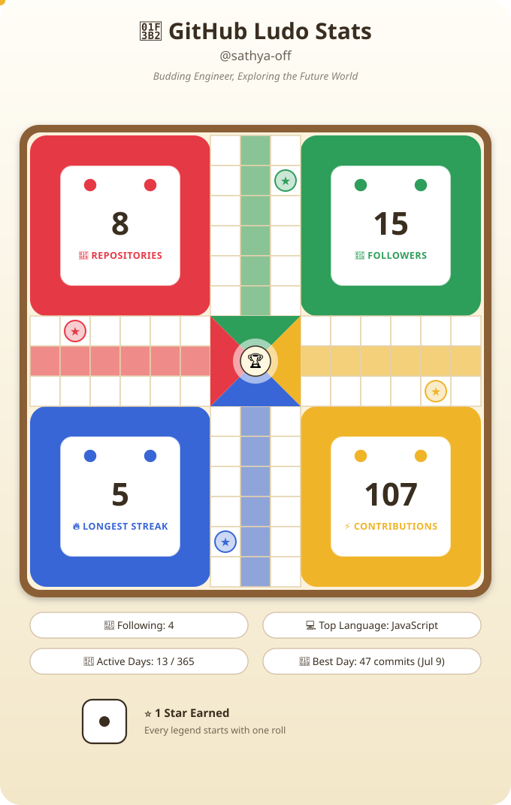

<h1>Hello Folks! 👋</h1>
────────────────────────────────────────────

I'm **Sathya R G**, a final-year **B.E. Electronics & Communication Engineering** student with a strong passion for **Java Software Development**, **SQL**, and **Problem Solving**. I enjoy transforming ideas into practical software solutions by building clean, efficient, and user-friendly applications. I continuously strengthen my knowledge of Data Structures and Algorithms, explore modern development practices, and work on real-world projects to enhance my technical skills. With a growth mindset and a commitment to continuous learning, I'm always ready to take on new challenges, collaborate with others, and contribute to innovative software development projects. 🚀

  

Check out my Profiles:

Technical Stacks Based On:

<h2>🧩 Coding Profiles & Problem Solving</h2>

<table>
<tr>
<th>LeetCode</th>
<th>HackerRank</th>
<th>NeetCode</th>
</tr>

<tr>

<td align="center">

</td>

<td align="center">

</td>

<td align="center">

</td>

</tr>
</table>

Github Stats

## 🎓 Education

| 🎓 **Degree** | 🏫 **Institution** | 📅 **Year** | 📊 **Score** |
|:-------------|:-------------------|:-----------:|:------------:|
| **B.E. Electronics & Communication Engineering** | **VSB Engineering College, Karur** | **2023 – Present** | **CGPA: 8.0** |
| **Higher Secondary Certificate (HSC)** | **Shri Renuga Vidhyalayam Matric Hr.sec.School, Theni** | **2022 – 2023** | **86%** |
| **Secondary School Leaving Certificate (SSLC)** | **Shri Renuga Vidhyalayam Matric Hr.sec.School, Thenir** | **2020 – 2021** | **86%** |

  

